## Lecture-6
#### 25-Apr-2021

#### Agenda : 
* Basic Data Visualization 
* Exploration of data


```python
import numpy as np
import pandas as pd
import matplotlib.pyplot as plt

xpoints = np.array([0,5])
ypoints = np.array([0,200])

plt.plot(xpoints,ypoints)
plt.show()

```


    

    


```python

plt.plot(xpoints,ypoints,'o') # When we dont want points joined
plt.show()

```


    

    


```python
xpoints = np.array([1,2,4,6])
ypoints = np.array([2,3,5,7])

plt.plot(xpoints,ypoints)
plt.show()
```


    
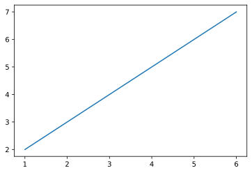
    


```python
import numpy as np
import pandas as pd
import matplotlib.pyplot as plt

xpoints = np.array([0,5])
ypoints = np.array([0,200])

plt.plot(xpoints,ypoints)
plt.show()
```


    
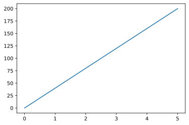
    


```python
plt.plot(xpoints,ypoints,'o')
plt.show()
```


    

    


```python
xpoints = np.array([1,2,5,9])
ypoints = np.array([2,3,3,13])

plt.plot(xpoints,ypoints)
plt.show()
```


    
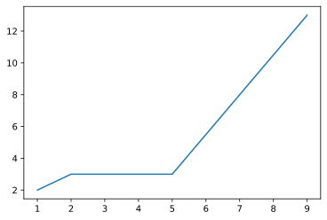
    


```python
ypoints = np.array([2,3,3,13,19,15,22,24])
plt.plot(ypoints) # if not given x it will consider the given data as y axis only.
plt.show()
```


    
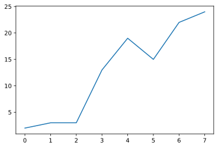
    


```python
plt.plot(ypoints, linestyle = 'dotted',color='red') # D for diamond
plt.title("This is the title of plot")
plt.xlabel("X axis")
plt.ylabel("Y axis")
plt.show()
```


    

    


```python
font1 = {'family':'serif', 'color':'red','size':10}
font2 = {'family':'serif', 'color':'blue','size':15}

plt.plot(ypoints, linestyle = 'dashed',color='red') # D for diamond
plt.title("This is the title of plot",fontdict=font2)
plt.xlabel("X axis",fontdict=font1)
plt.ylabel("Y axis",fontdict=font1)
plt.show()
```


    
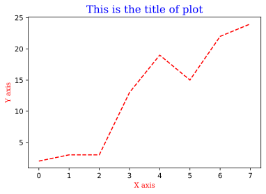
    


```python
bikes = pd.read_csv('bikedata.csv')
bikes.head()
```


<div>
<style scoped>
    .dataframe tbody tr th:only-of-type {
        vertical-align: middle;
    }

    .dataframe tbody tr th {
        vertical-align: top;
    }

    .dataframe thead th {
        text-align: right;
    }
</style>
<table border="1" class="dataframe">
  <thead>
    <tr style="text-align: right;">
      <th></th>
      <th>instant</th>
      <th>dteday</th>
      <th>season</th>
      <th>yr</th>
      <th>mnth</th>
      <th>hr</th>
      <th>holiday</th>
      <th>weekday</th>
      <th>workingday</th>
      <th>weathersit</th>
      <th>temp</th>
      <th>atemp</th>
      <th>hum</th>
      <th>windspeed</th>
      <th>casual</th>
      <th>registered</th>
      <th>cnt</th>
    </tr>
  </thead>
  <tbody>
    <tr>
      <th>0</th>
      <td>1</td>
      <td>2011-01-01</td>
      <td>1</td>
      <td>0</td>
      <td>1</td>
      <td>0</td>
      <td>0</td>
      <td>6</td>
      <td>0</td>
      <td>1</td>
      <td>0.24</td>
      <td>0.2879</td>
      <td>0.81</td>
      <td>0.0</td>
      <td>3</td>
      <td>13</td>
      <td>16</td>
    </tr>
    <tr>
      <th>1</th>
      <td>2</td>
      <td>2011-01-01</td>
      <td>1</td>
      <td>0</td>
      <td>1</td>
      <td>1</td>
      <td>0</td>
      <td>6</td>
      <td>0</td>
      <td>1</td>
      <td>0.22</td>
      <td>0.2727</td>
      <td>0.80</td>
      <td>0.0</td>
      <td>8</td>
      <td>32</td>
      <td>40</td>
    </tr>
    <tr>
      <th>2</th>
      <td>3</td>
      <td>2011-01-01</td>
      <td>1</td>
      <td>0</td>
      <td>1</td>
      <td>2</td>
      <td>0</td>
      <td>6</td>
      <td>0</td>
      <td>1</td>
      <td>0.22</td>
      <td>0.2727</td>
      <td>0.80</td>
      <td>0.0</td>
      <td>5</td>
      <td>27</td>
      <td>32</td>
    </tr>
    <tr>
      <th>3</th>
      <td>4</td>
      <td>2011-01-01</td>
      <td>1</td>
      <td>0</td>
      <td>1</td>
      <td>3</td>
      <td>0</td>
      <td>6</td>
      <td>0</td>
      <td>1</td>
      <td>0.24</td>
      <td>0.2879</td>
      <td>0.75</td>
      <td>0.0</td>
      <td>3</td>
      <td>10</td>
      <td>13</td>
    </tr>
    <tr>
      <th>4</th>
      <td>5</td>
      <td>2011-01-01</td>
      <td>1</td>
      <td>0</td>
      <td>1</td>
      <td>4</td>
      <td>0</td>
      <td>6</td>
      <td>0</td>
      <td>1</td>
      <td>0.24</td>
      <td>0.2879</td>
      <td>0.75</td>
      <td>0.0</td>
      <td>0</td>
      <td>1</td>
      <td>1</td>
    </tr>
  </tbody>
</table>
</div>


```python
plt.plot(bikes.temp)
```


    [<matplotlib.lines.Line2D at 0x19712fc6688>]


    

    


```python
plt.plot(bikes.cnt,'o')
```


    [<matplotlib.lines.Line2D at 0x19715007e48>]


    

    


### Bivariate Analysis 


```python
plt.plot(bikes.season,bikes.cnt)
```


    [<matplotlib.lines.Line2D at 0x19716fd3688>]


    
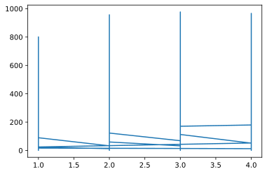
    


```python
plt.plot(bikes.holiday,bikes.cnt,'o')
```


    [<matplotlib.lines.Line2D at 0x197143e3908>]


    
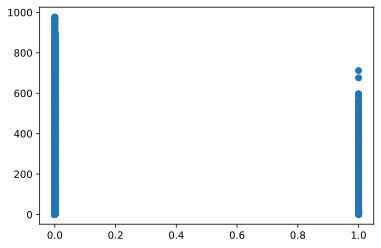
    


```python
byseasons = bikes.groupby("season")
countbyseason = byseasons.cnt.sum().sort_values()
countbyseason
```


    season
    1     471348
    4     841613
    2     918589
    3    1061129
    Name: cnt, dtype: int64


```python
plt.plot(bikes.season.unique(), countbyseason)
```


    [<matplotlib.lines.Line2D at 0x197169e2708>]


    
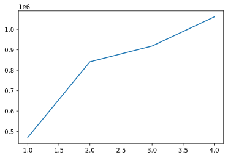
    


### Seaborn


```python
import seaborn as sns
sns.__version__
```


    '0.11.1'


```python
tips = sns.load_dataset('tips')
tips.head()
```


<div>
<style scoped>
    .dataframe tbody tr th:only-of-type {
        vertical-align: middle;
    }

    .dataframe tbody tr th {
        vertical-align: top;
    }

    .dataframe thead th {
        text-align: right;
    }
</style>
<table border="1" class="dataframe">
  <thead>
    <tr style="text-align: right;">
      <th></th>
      <th>total_bill</th>
      <th>tip</th>
      <th>sex</th>
      <th>smoker</th>
      <th>day</th>
      <th>time</th>
      <th>size</th>
    </tr>
  </thead>
  <tbody>
    <tr>
      <th>0</th>
      <td>16.99</td>
      <td>1.01</td>
      <td>Female</td>
      <td>No</td>
      <td>Sun</td>
      <td>Dinner</td>
      <td>2</td>
    </tr>
    <tr>
      <th>1</th>
      <td>10.34</td>
      <td>1.66</td>
      <td>Male</td>
      <td>No</td>
      <td>Sun</td>
      <td>Dinner</td>
      <td>3</td>
    </tr>
    <tr>
      <th>2</th>
      <td>21.01</td>
      <td>3.50</td>
      <td>Male</td>
      <td>No</td>
      <td>Sun</td>
      <td>Dinner</td>
      <td>3</td>
    </tr>
    <tr>
      <th>3</th>
      <td>23.68</td>
      <td>3.31</td>
      <td>Male</td>
      <td>No</td>
      <td>Sun</td>
      <td>Dinner</td>
      <td>2</td>
    </tr>
    <tr>
      <th>4</th>
      <td>24.59</td>
      <td>3.61</td>
      <td>Female</td>
      <td>No</td>
      <td>Sun</td>
      <td>Dinner</td>
      <td>4</td>
    </tr>
  </tbody>
</table>
</div>


```python
type(tips)
```


    pandas.core.frame.DataFrame


```python
sns.scatterplot(data=tips, x = tips["sex"], y=tips["tip"])
```


    <matplotlib.axes._subplots.AxesSubplot at 0x1971df69c08>


    
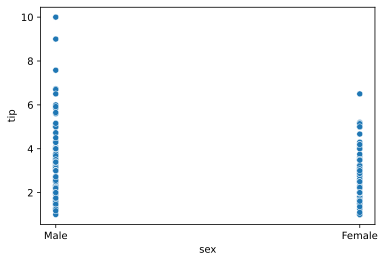
    


```python
sns.scatterplot(data=tips, x ='total_bill', y='tip')
```


    <matplotlib.axes._subplots.AxesSubplot at 0x131f6a7a4c8>


    

    


```python
sns.lineplot(data=tips, x = 'total_bill', y = 'tip')
```


    <matplotlib.axes._subplots.AxesSubplot at 0x131fac0ccc8>


    

    


```python
sns.relplot(data=tips, x = 'total_bill', y = 'tip')
# Relplot does not have a box. it looks like more real and appealing 
```


    <seaborn.axisgrid.FacetGrid at 0x131fb6ab988>


    
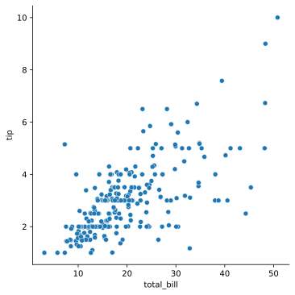
    


```python
sns.scatterplot(data=tips, x ='total_bill', y='tip', hue = 'sex')
```


    <matplotlib.axes._subplots.AxesSubplot at 0x131fac34248>


    
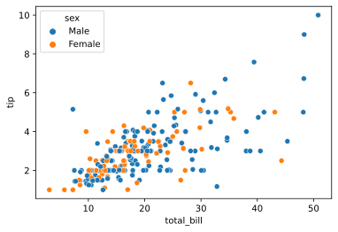
    


```python
sns.scatterplot(data=tips, x ='total_bill', y='tip', hue = 'time',style='smoker')
```


    <matplotlib.axes._subplots.AxesSubplot at 0x131fb216148>


    
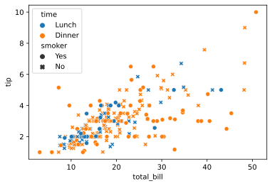
    


```python
sns.relplot(data=tips, x ='total_bill', y='tip', col='day', hue='sex')
```


    <seaborn.axisgrid.FacetGrid at 0x131fb9dde88>


    
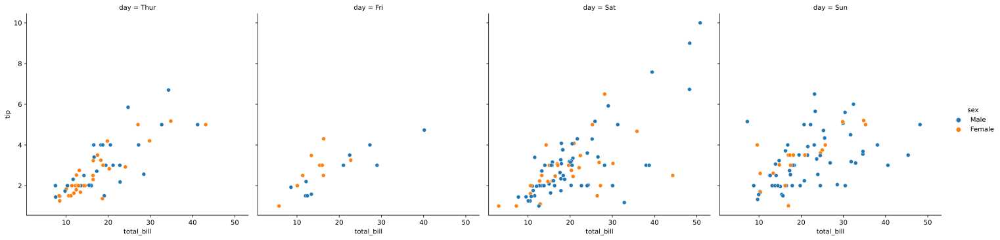
    


```python
sns.relplot(data=tips, x ='total_bill', y='tip', col='day', hue='time')
```


    <seaborn.axisgrid.FacetGrid at 0x131fbd58988>


    
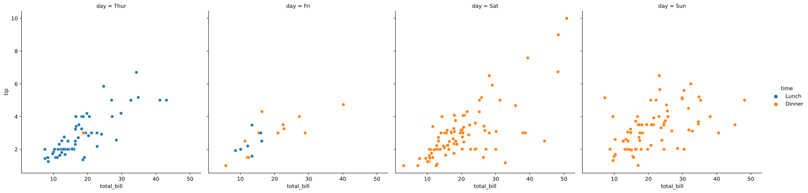
    


```python
male = tips[tips.sex == 'Male']
sns.relplot(data=male, x ='total_bill', y='tip', hue='time')
```


    <seaborn.axisgrid.FacetGrid at 0x131fd0f3988>


    

    


```python
female = tips[tips.sex == 'Female']
sns.relplot(data=female, x ='total_bill', y='tip', hue='time')
```


    <seaborn.axisgrid.FacetGrid at 0x131fda2da08>


    
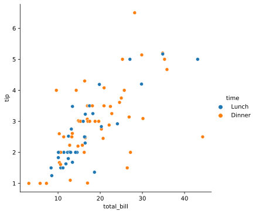
    


```python
# Category plot 
sns.catplot(data = tips, x = "sex", y = "total_bill", jitter = False)
```


    <seaborn.axisgrid.FacetGrid at 0x131fcd27108>


    
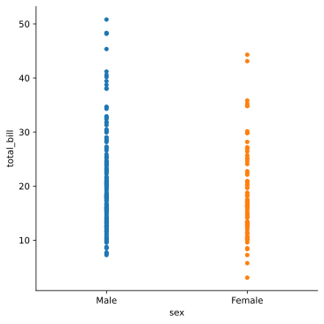
    


```python
sns.catplot(data = tips, x = "sex", y = "total_bill", kind = 'swarm') # Tells frequency also 
```


    <seaborn.axisgrid.FacetGrid at 0x131ff593748>


    

    


```python
sns.catplot(data = tips, x = "sex", y = "total_bill", kind = 'swarm', hue ='time')
```


    <seaborn.axisgrid.FacetGrid at 0x131fdc844c8>


    

    


```python
sns.catplot(data = tips, x = "sex", y = "total_bill", kind = 'box')
```


    <seaborn.axisgrid.FacetGrid at 0x131fdbf9108>


    
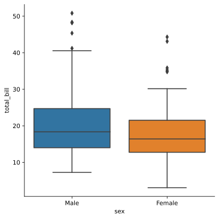
    


```python
sns.catplot(data = tips, x = "sex", y = "total_bill", kind = 'violin', hue = 'time')
```


    <seaborn.axisgrid.FacetGrid at 0x131fdd73688>


    
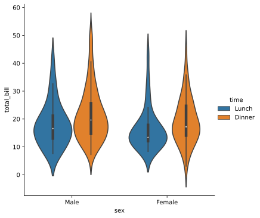
    


```python
titanic = sns.load_dataset('titanic')
titanic.info()
```

    <class 'pandas.core.frame.DataFrame'>
    RangeIndex: 891 entries, 0 to 890
    Data columns (total 15 columns):
     #   Column       Non-Null Count  Dtype   
    ---  ------       --------------  -----   
     0   survived     891 non-null    int64   
     1   pclass       891 non-null    int64   
     2   sex          891 non-null    object  
     3   age          714 non-null    float64 
     4   sibsp        891 non-null    int64   
     5   parch        891 non-null    int64   
     6   fare         891 non-null    float64 
     7   embarked     889 non-null    object  
     8   class        891 non-null    category
     9   who          891 non-null    object  
     10  adult_male   891 non-null    bool    
     11  deck         203 non-null    category
     12  embark_town  889 non-null    object  
     13  alive        891 non-null    object  
     14  alone        891 non-null    bool    
    dtypes: bool(2), category(2), float64(2), int64(4), object(5)
    memory usage: 80.6+ KB
    


```python
sns.distplot(titanic['survived'] )
```

    C:\Users\pandey\AppData\Local\Programs\Python\Python37\lib\site-packages\seaborn\distributions.py:2557: FutureWarning: `distplot` is a deprecated function and will be removed in a future version. Please adapt your code to use either `displot` (a figure-level function with similar flexibility) or `histplot` (an axes-level function for histograms).
      warnings.warn(msg, FutureWarning)
    


    <matplotlib.axes._subplots.AxesSubplot at 0x131846b9c88>


    
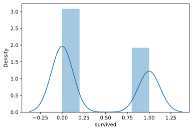
    


```python
sns.pairplot(titanic[['survived','pclass','fare','sibsp']])
```


    <seaborn.axisgrid.PairGrid at 0x131859c0c08>


    

    


```python

```
